```{r}
#| echo: false
#| warning: false
#| message: false
#| results: hide

# packages
library(tidyverse)
library(scales)

# median home prices
singlefamily <- read_csv("data/single_family_houses.csv") |>
  mutate(date = mdy(date))

# average faculty salaries
faculty_salary <- tribble(
  ~date, ~avg_salary,
  "2012-01-01", 95000,
  "2013-01-01", 97000,
  "2014-01-01", 99000,
  "2015-01-01", 101000,
  "2016-01-01", 103000,
  "2017-01-01", 105000,
  "2018-01-01", 107000,
  "2019-01-01", 109000,
  "2020-01-01", 111000,
  "2021-01-01", 113000,
  "2022-01-01", 114303,
  "2023-01-01", 116446,
  "2024-01-01", 117913,
  "2025-01-01", 118500,
  "2026-01-01", 120000) |>
  mutate(date = parse_date(date))
```

```{r}
#| echo: false 
#| warning: false 
#| message: false 
#| results: hide

visual <- singlefamily |>
  ggplot(aes(x = date, y = median.price)) + 
  
  # line for median home values
  geom_line(aes(color = "Median Home Values")) + 
  
  # fixing x-axis ticks to remove months
  scale_x_date(date_breaks = "1 year",
               date_minor_breaks = "1 month",
               date_labels = "%Y") +
  
  # fixing y-axis ticks to be simpler
  scale_y_continuous(labels = label_number(scale = 1e-3, suffix = "k")) +
  
  # making x-axis tickets at a better angle (to be less clustered)
  theme(text = element_text(family = "Times New Roman"), 
        axis.text.x = element_text(angle = 45, hjust = 1)) +
  
  # labels
  labs(title = "Median Single-Family House Values",
       subtitle = "Northampton, 2012–2026",
       x = "Year",
       y = "USD",
       color = "Key",
       caption = "Sources: Redfin News, AAUP, Univstats") + 
  scale_color_manual(values = c("Median Home Values" = "black"))
``` 
  
```{r}
#| echo: false 
#| warning: false 
#| message: false 
#| results: hide

vis_regressionline <- visual + 
  
  # adding regression line
  geom_smooth(aes(color = "Trend of Home Values"),
              se = FALSE, 
              linewidth = 0.5) + 
  scale_color_manual(values = c("Median Home Values" = "black",
                                "Trend of Home Values" = "darkgray"))
```
 
```{r}
#| echo: false 
#| warning: false 
#| message: false 
#| results: hide

vis_lowest <- visual + 
  
  # text for lowest home values
  annotate("text", 
           x = as.Date("2014-01-31"), 
           y = 196000,
           label = "$196k in March '14",
           hjust = -0.6,
           vjust = 0.4,
           color = "red3", 
           family = "Times New Roman") +
  
  # arrow for lowest home values
  annotate("segment",
           x = as.Date("2016-04-30"),
           xend = as.Date("2014-04-30"),
           y = 194000,
           yend = 194000,
           arrow = arrow(length = unit(0.2, "cm")),
           color = "red3") + 
  scale_color_manual(values = c("Median Home Values" = "black",
                                "Trend of Home Values" = "darkgray"))
```
 
```{r}
#| echo: false 
#| warning: false 
#| message: false 
#| results: hide

vis_highest <- visual + 
  
  # text for highest home values
  annotate("text", 
           x = as.Date("2025-10-31"), 
           y = 798000,
           label = "$798k in October '25",
           hjust = 1.3,
           vjust = 0.7,
           color = "red3", 
           family = "Times New Roman") +
  
  # arrow for highest home values
  annotate("segment",
           x = as.Date("2024-09-30"),
           xend = as.Date("2025-09-30"),
           y = 797000,
           yend = 797000,
           arrow = arrow(length = unit(0.2, "cm")),
           color = "red3") + 
  scale_color_manual(values = c("Median Home Values" = "black",
                                "Trend of Home Values" = "darkgray"))
```

```{r}
#| echo: false 
#| warning: false 
#| message: false 
#| results: hide


vis_salary <- vis_regressionline + 
  
  # faculty salary line
  geom_line(data = faculty_salary,
            aes(x = date, y = avg_salary, color = "Average Faculty Salary"),
            linewidth = 0.5) + 
  scale_color_manual(values = c("Median Home Values" = "black",
                                "Trend of Home Values" = "darkgray",
                                "Average Faculty Salary" = "blue3"))
```

```{r}
vis_2014 <- visual + 
  
  # northampton median point
  annotate("point", 
           x = as.Date("2024-02-28"),
           y = 420000, 
           colour = "red3", 
           size = 2) + 
  
  # holyoke median point
  annotate("point", 
           x = as.Date("2024-02-28"),
           y = 350000, 
           colour = "blue3", 
           size = 2) + 
  
  # caption 
  annotate("text", 
           x = as.Date("2019-10-01"), 
           y = 250000,
           label = "Northampton Median Home Price",
           color = "red3", 
           family = "Times New Roman", 
           hjust = 0) + 
  annotate("text", 
           x = as.Date("2019-10-01"), 
           y = 225000,
           label = "Holyoke Median Home Price",
           color = "blue3", 
           family = "Times New Roman", 
           hjust = 0)
```

```{r}
vis_dunetz <- visual + 
  
  # northampton median point
  annotate("point", 
           x = as.Date("2012-01-31"),
           y = 207000, 
           colour = "red3", 
           size = 2) + 
  
  # dunetz home price
  annotate("point", 
           x = as.Date("2012-01-31"),
           y = 190000, 
           colour = "blue3", 
           size = 2) + 
  
  # caption 
  annotate("text", 
           x = as.Date("2012-01-01"), 
           y = 560000,
           label = "Northampton Median Home Price",
           color = "red3", 
           family = "Times New Roman", 
           hjust = 0) + 
  annotate("text", 
           x = as.Date("2012-01-01"), 
           y = 525000,
           label = "Dunetz's Home Price",
           color = "blue3", 
           family = "Times New Roman", 
           hjust = 0) + 
  annotate("text", 
           x = as.Date("2012-01-01"), 
           y = 475000,
           label = "*Earliest data we have is from 2012, a year \nafter Dunetz purchased his home",
           color = "black", 
           family = "Times New Roman", 
           size = 3, 
           hjust = 0)
```
<style>
figcaption {
  font-size: 0.8em;
}
</style>
:::{.cr-section}
As the housing affordability crisis in Western Massachusetts continues to worsen, even those considered to be some of the most privileged and educated members of our community are struggling to afford homes in the area. @cr-smithGates

:::{#cr-smithGates}

:::

Many of Smith’s faculty members, especially junior faculty, can’t afford to buy property in Northampton, they report. The median cost of a single-family home in Northampton has nearly tripled since January 2012. Because of this, many new faculty members have resorted to renting or purchasing houses elsewhere, some in neighboring towns and others with commutes over 30 minutes.

With Northampton’s growing demand for housing is in tension with limited rental units, Smith is scrambling to keep faculty connected to the community they teach in. @cr-lacombeQuote 

Former Smith professor of Government and Statistical and Data Sciences, Scott LaCombe explained newer professors tend to own homes in farther-away towns, while tenured professors tend to own homes much closer to campus. [@cr-lacombeQuote]{highlight="2"}

:::{#cr-lacombeQuote}
<div style="position: relative; top: 50%; transform: translateY(-50%); text-align: center;">

| “It's kind of funny; amongst Smith faculty 
| [you can basically tell what year they were hired]{#cr-yearHired} 
| based on how far they lived from campus."

</div>
:::

LaCombe started at Smith in the fall of 2020 and lived in faculty housing until February of 2024 @cr-lacombeNoho

:::{#cr-lacombeNoho}
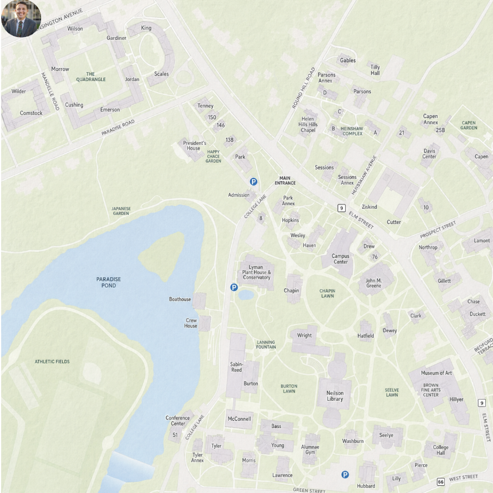
:::

When he purchased a home in Holyoke with his family. @cr-lacombeHolyoke

:::{#cr-lacombeHolyoke}
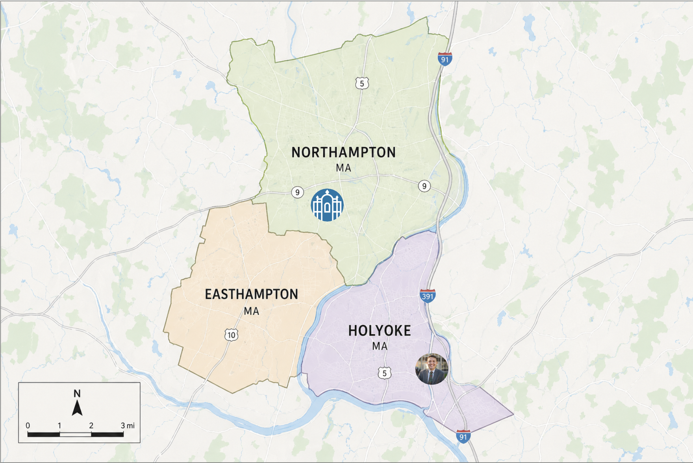
:::

His house in Holyoke sold for 350 thousand dollars. @cr-vis2014 


At the time, the median price of a single-family home in Northampton was 420 thousand dollars.[@cr-vis2014]{pan-to="-30%,10%" scale-by="2"}

:::{#cr-vis2014}
```{r}
#| echo: false 
#| warning: false 
#| message: false 

vis_2014
```
:::

[@cr-lacombeQuote2] Last Spring, LaCombe and his family moved to Missouri, partially to be closer to family, as well as high housing costs and underperforming schools in Holyoke. 

:::{#cr-lacombeQuote2}
| “If we had been able to afford it, 
| we would have stayed in Northampton, 
| but there was just no universe that we 
| were going to be able to be homeowners 
| long term. Even in towns like Holyoke, 
| which are more affordable, you can see 
| real estate prices just everywhere in 
| Massachusetts are just skyrocketing.” 
| LaCombe said.
:::

While many junior faculty members rent or own property in surrounding towns, senior faculty and staff who have been in the area for many years were often able to buy their homes before the prices climbed to their current levels. Many of these people bought their homes over 10 years ago, when housing prices were much lower. Now, a lot of faculty consider themselves lucky for being able to own a home close to campus. @cr-nohoAerial 

:::{#cr-nohoAerial}
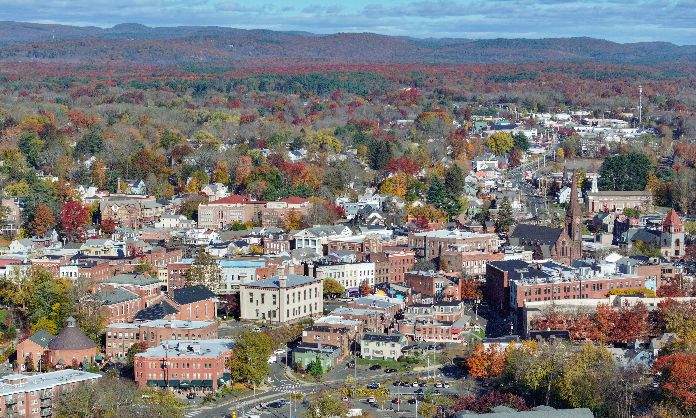
:::

An analysis of data shows that since 2012, median single-family home values in Northampton have increased exponentially. @cr-visual

With the highest median single-family home value being nearly 800 thousand dollars in October of last year. [@cr-visual]{pan-to="0%,0%" scale-by="2"} [@cr-vis_highest]{scale-by="2"}

:::{#cr-visual}
```{r}
#| echo: false 
#| warning: false 
#| message: false 

visual
```
:::

:::{#cr-vis_highest}
```{r}
#| echo: false 
#| warning: false 
#| message: false 

vis_highest
```
:::

The lowest median single family home value was in March 2014 with prices dipping just below 200 thousand dollars. [@cr-vis_lowest]{pan-to="20%,-10%" scale-by="2"}

:::{#cr-vis_lowest}
```{r}
#| echo: false 
#| warning: false 
#| message: false 

vis_lowest
```
:::

As of February, the median cost of a single-family home is 609 thousand dollars, which is nearly triple the median in January of 2012. @cr-vis_regressionline

:::{#cr-vis_regressionline}
```{r}
#| echo: false 
#| warning: false 
#| message: false 

vis_regressionline
```
:::

On the other hand, average faculty salaries have only increased 26 percent on the same timeline, with the cumulative inflation having been about 45 percent. @cr-vis_salary

:::{#cr-vis_salary}
```{r}
#| echo: false 
#| warning: false 
#| message: false 

vis_salary
```
:::

Adam Dunetz, one of Smith’s dining managers, said that he bought his home for 190 thousand dollars in 2011. [@cr-visDunetz]{pan-to="50%,10%" scale-by="1.5"}

:::{#cr-visDunetz}
```{r}
#| echo: false 
#| warning: false 
#| message: false 

vis_dunetz
```
:::

His street dead ends to a sewage treatment facility, which, although off-putting to other buyers, worked in his favor. @cr-dunetzQuote 

:::{#cr-dunetzQuote}
| “It was even a good deal then!” Dunetz said.
:::

According to Dunetz, however, like rest of the city home values in his neighborhood have increased "exponentially" since then. @cr-dunetzQuote2

He explained that such good deals are becoming rarer and rarer and that his family is effectively trapped in their current home due to the Northampton housing market. [@cr-dunetzQuote2]{highlight="1"}

:::{#cr-dunetzQuote2}
| “We’ll probably live in this house for the rest of our lives,” 
| Dunetz said, expressing minimal hope that his family will ever be 
| able to buy property again in the current Northampton market 
| unless something changes drastically. 
:::

Jeremy Bonios, the retail dining manager for the Campus Center and Compass Cafe, has owned property in Northampton for ten years. He moved here from Los Angeles eleven years ago and was able to buy a home after renting for just one year in the area. @cr-bonoisPic

:::{#cr-bonoisPic}
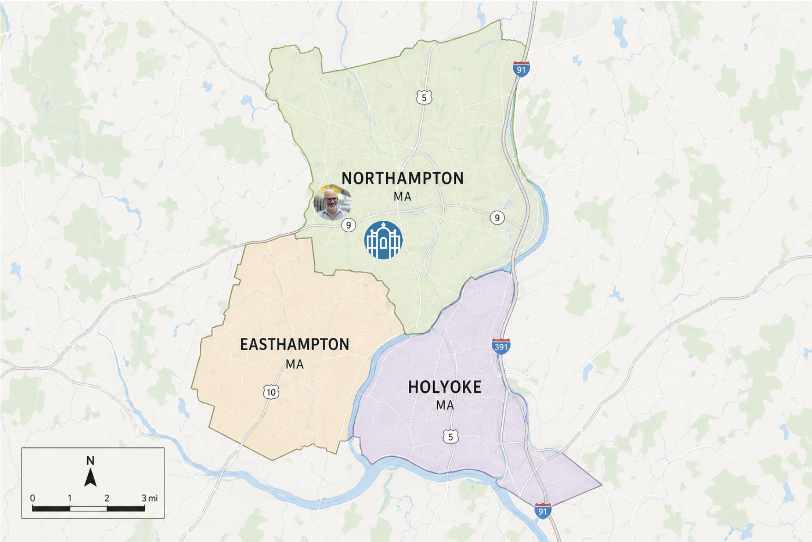
:::

Bonios owns multiple rental units in a multi-family home, which he manages with his wife. They have witnessed both sides of the increase in housing costs, and he expressed that they have been both positively and negatively impacted. @cr-bonoisQuote

Along with the increase in property taxes, Bonios reports that his homeowner’s insurance increased by almost 30% in just one year, dramatically increasing his monthly expenses for his property. [@cr-bonoisQuote]{highlight="3"}

:::{#cr-bonoisQuote}
| “Property values are increasing, and while it 
| is good in the long run, in my immediate life 
| I am paying more property taxes,” Bonios said. 
:::

These rising costs have forced landlords to increase rent in order to keep up with their own expenses. @cr-bonoisQuote2

:::{#cr-bonoisQuote2}
| “A lot of these landlords are people like me,” 
| Bonios said. “They have had their property taxes 
| and also homeowner’s insurance go up, and so that, 
| in turn, reflects in the cost of rent.” 
:::

Many newer faculty members with a desire to own property, like LaCombe, have turned to neighboring towns with much lower prices. @cr-neighboringTowns

:::{#cr-neighboringTowns}
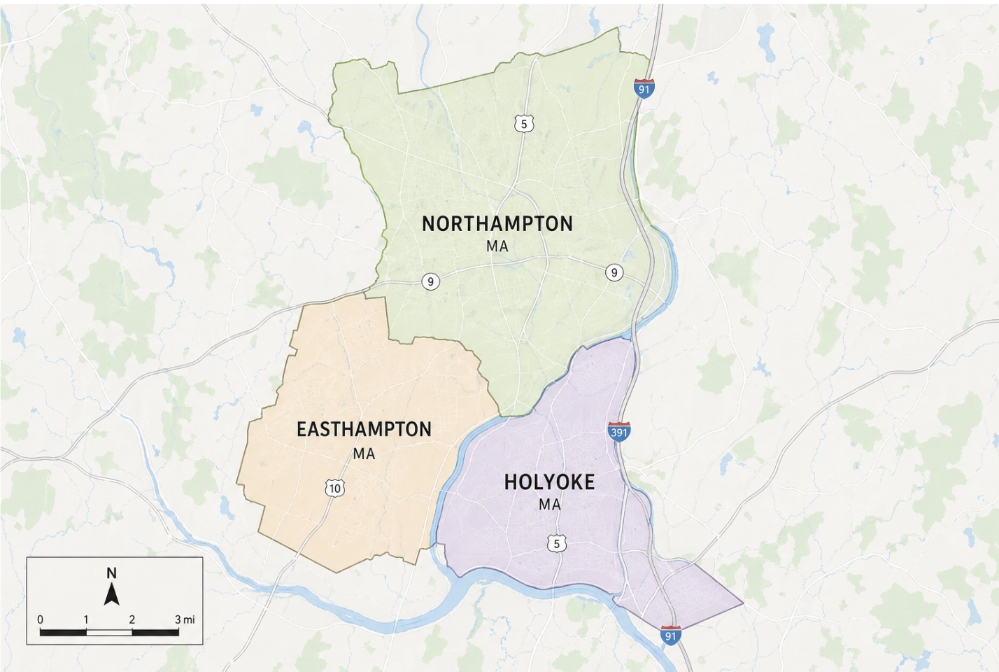
:::

Ab Mosca is a second-year professor at Smith who owns a home in Holyoke. [@cr-moscaPic]{pan-to="-20%,-100%" scale-by="4"} 

Prior to their move to Holyoke, Mosca rented a 2-bedroom apartment in Northampton for $2100 a month. [@cr-moscaPic]{pan-to="0%,70%" scale-by="3"}

:::{#cr-moscaPic}
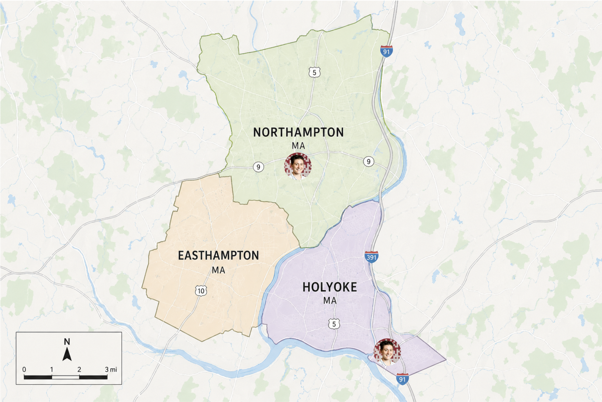
:::

They expressed that they would have loved to live in Northampton long-term but opted to purchase somewhere more affordable. @cr-moscaQuote

Even in Holyoke, Mosca paid 350 thousand dollars for their home and lives with a roommate to help cover the cost of the mortgage. [@cr-moscaQuote]{highlight="2,3"}

:::{#cr-moscaQuote}
| “I could not afford to buy anything in Northampton, 
| Holyoke was the only place that was affordable 
| and still a reasonable drive for me,” they explained. 
| “Northampton is much more expensive than Holyoke; 
| you get much less space for your money.”
:::

Smith College has various longstanding programs in an effort to help faculty afford to live in the area. @cr-collegeHall

:::{#cr-collegeHall}
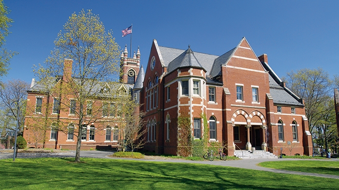
:::

The college owns a total of 35 buildings and 86 rental units through 3 College Rentals, which serves faculty from Smith, Mount Holyoke, and Amherst College. @cr-rentalOffice

:::{#cr-rentalOffice}
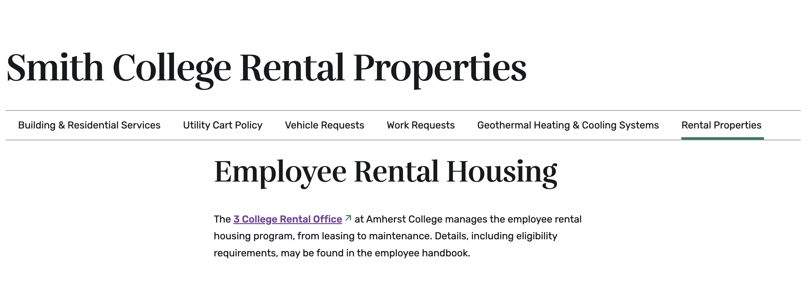
:::

About half of the units are occupied by staff and the other half are occupied by faculty members. 

But it's not enough. @cr-synderQuote

:::{#cr-synderQuote}
| “Quite honestly, I think that the need outpaces the stock. 
| The need out there is much more than we have for availability,” 
| said Larry Syder, AVP of Campus Services, Operations & Maintenance.
:::

In November, the Daily Hampshire Gazette reported on [Smith College spiking rents for tenants](https://gazettenet.com/2025/11/20/smith-college-tenants-call-on-school-to-honor-rent-increase-agreements/) by nearly 28%. @cr-gazzetteArticle

:::{#cr-gazzetteArticle}
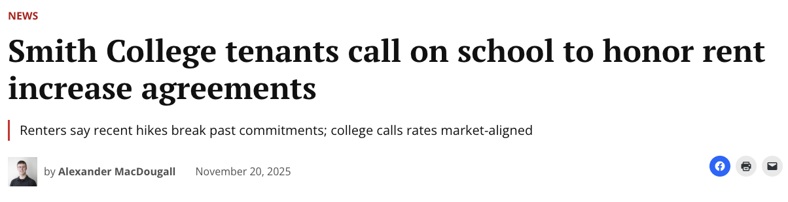
:::

The college responded to the article by saying: @cr-collegeResponse

:::{#cr-collegeResponse}
| “The rental rates are set in an attempt to stay in line 
| with the current market, and the revenue is used to cover 
| costs such as property taxes, updates, and maintenance. 
| While Smith does not speak to the details of individual 
| leases, the college does comply with the terms of all 
| documented agreements related to its rental properties.”
:::

Anne-Marie Smzyt, VP for Human Resources, acknowledged the balance between affordability and profit for the college. @cr-smzytQuote

:::{#cr-smzytQuote}
| “People are focused on what the percentage is, not 
| necessarily what the dollar amount is,” said Smzyt. 
| “We’d love to make our housing as close to nothing 
| as we possibly can, but that’s not reality.”
:::

Smith College also offers a second mortgage program to try and make buying a house more attainable. The program is a legally binding lien document on the house and is repaid to Smith over the course of the 30-year mortgage. This program is available to full-time faculty who are purchasing their first home and are relocating to Northampton for their employment. [@cr-eligibility]

:::{#cr-eligibility}
| "For Faculty: Are a full-time faculty member 
| in a ladder or renewable position. For 
| Faculty with Five College joint appointments, 
| Smith College must be the home institution."
:::

When investigation for this article began, the college offered up to 70 thousand dollars to eligible faculty members. [@cr-szmytQuote2]{highlight="1,2"}

Since then, the amount has been increased to 75 thousand dollars. The money can be put towards the down payment of the home, buying mortgage points, or reducing their monthly mortgage payments. [@cr-szmytQuote2]{highlight="3,4,5"}

Payments to the college for the second mortgage along with interest, which is fixed at 80 percent of the applicable federal rate (AFR) at the time the loan is established, are deducted from each paycheck to simplify the process. [@cr-szmytQuote2]

:::{#cr-szmytQuote2}
| “We've had many conversations, and we do often, if 
| 70,000 is the right amount of money,” said Szmyt. 
| “We're at a point right now with all the financial 
| headwinds coming in at the college that we want to 
| be really careful that we're not overextending.”
:::

:::

:::{.cr-section}

Even with the second mortgage program, many Smith faculty have had no choice but to rent in order to be close to campus. @cr-smithMap

Gillian Beltz-Mohrmann, assistant professor of Physics and Statistical and Data Sciences, is in her first year at Smith. [@cr-smithMap]{pan-to="-50%,50%" scale-by="2"}

:::{#cr-smithMap}
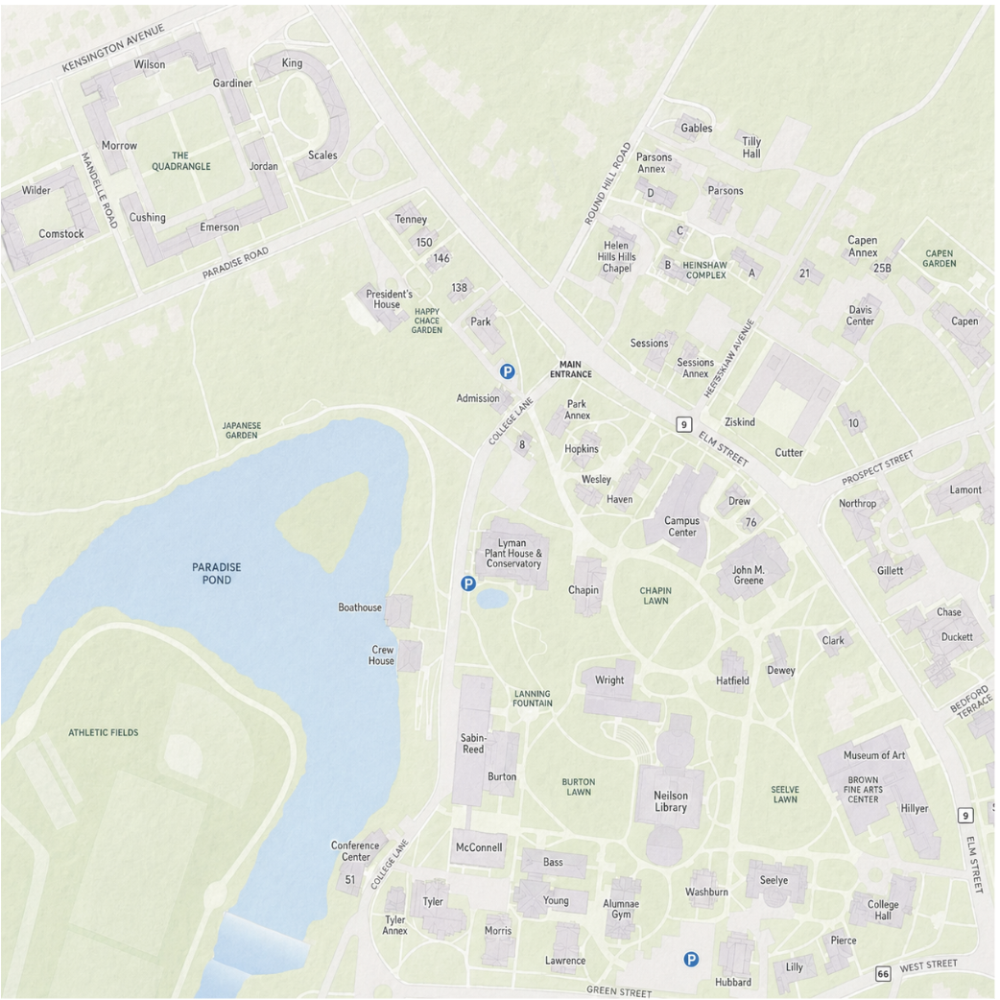
:::

:::

:::{.cr-section}

She explained that she and her husband cannot afford to own a home in Northampton, so they rent through Smith College. [@cr-beltzMohrmann]{pan-to="-50%,50%" scale-by="2"}

:::{#cr-beltzMohrmann}

:::

She said her experience with Smith as a landlord has been very positive but also said that she “got lucky.”

Similarly, Rebecca Kurtz-Garcia, an assistant professor of Mathematics and Statistical and Data Sciences, and her husband moved to Northampton three years ago from California when they both joined the faculty. @cr-kurtzGarcia

:::{#cr-kurtzGarcia}
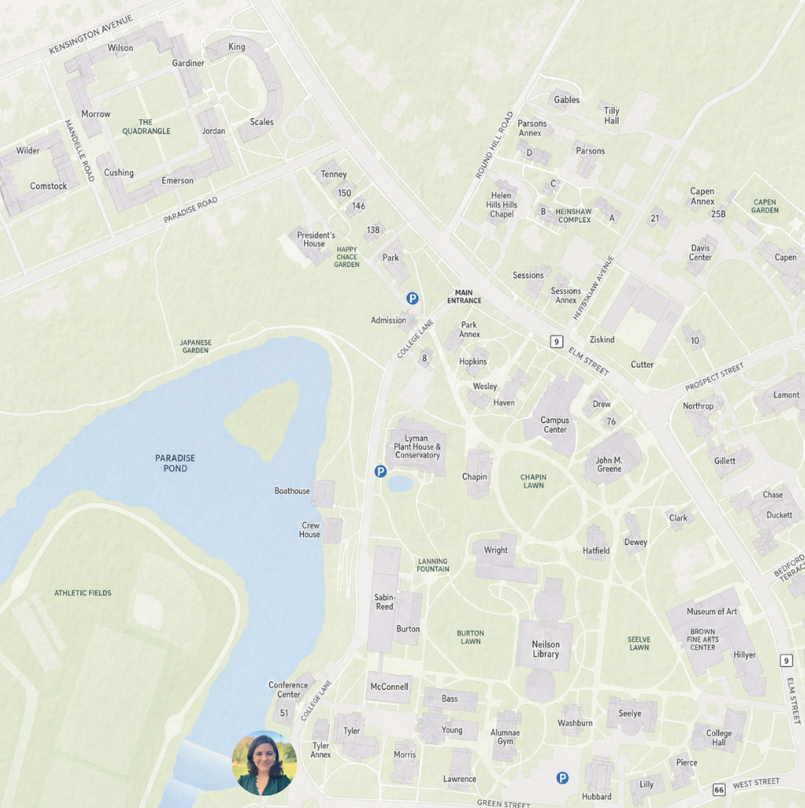
:::

They rented through Smith College as well and shared the sentiment that the experience has been positive. 

Kurtz-Garcia mentioned that when she interviewed, her fellow faculty members told her about the faculty housing that Smith offered and recommended that she look into it. 

In the end, Northampton’s housing crisis isn’t just about the rising prices or shifting markets; it’s also about the future of a community built around a college that depends on its people. As long as faculty are pushed farther from campus, Smith risks losing something harder to quantify than mortgage payments or rental stock: the everyday presence of our future generations’ educators in the community. And unfortunately, Northampton’s housing prices reflect broader national trends, not just local policy failures. Northampton’s choice to adapt or hold tight to the status quo will shape not just the city’s housing landscape but also the future of the community that depends on it. @cr-chapinLawn

:::{#cr-chapinLawn}
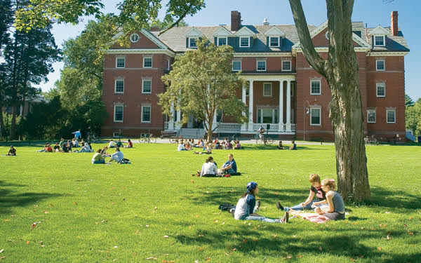
:::

“For a liberal arts college you kind of want faculty to be close, right?” said LaCombe. “Because it’s more of a community. I think that it’s also a loss for Smith to not have the faculty invested in Northampton.”

:::
